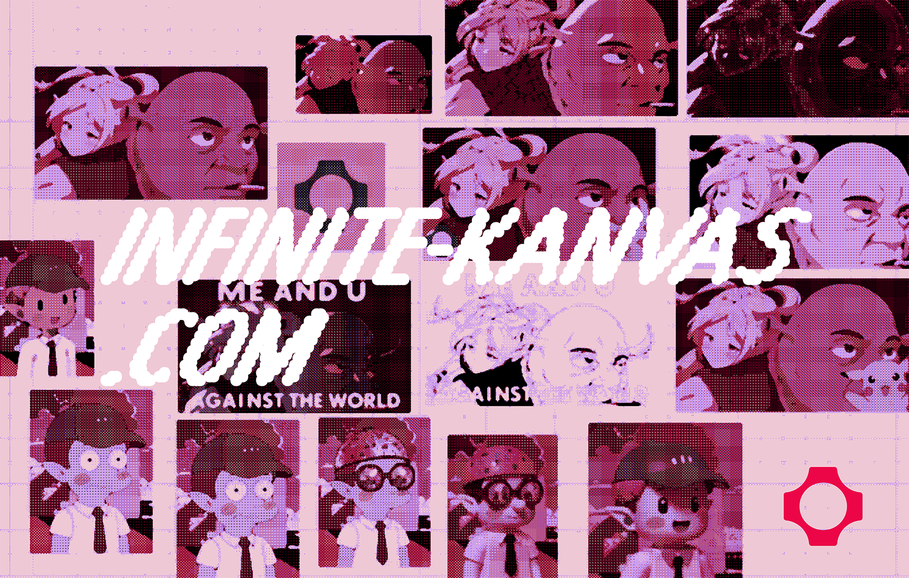

# Infinite Kanvas



An infinite canvas image editor with AI transformations using fal.ai. Built with Next.js, React Konva, and tRPC.

## Features

- **Infinite Canvas**: Pan/zoom with viewport culling for performance
- **AI Transformations**: Style transfer, background removal, object isolation via fal.ai
- **Multiplayer**: Real-time collaborative editing with PartyKit
- **Authentication**: Clerk integration with secure user management
- **Persistence**: Cloudflare D1 database, R2 storage, and KV cache
- **Real-time Streaming**: Live AI generation updates with progress indicators
- **Drag & Drop**: Seamless image upload and manipulation
- **Auto-save**: Persistent canvas state with history

## Technical Details

### Canvas

React Konva for 2D canvas rendering with viewport culling for performance.

### fal.ai Integration

The app integrates with fal.ai's API in several clever ways:

#### 1. Proxy Architecture

To bypass Vercel's 4.5MB request body limit, we implement a proxy pattern:

```typescript
// Client uploads through proxy
const uploadResult = await falClient.storage.upload(blob);

// Proxy endpoint at /api/fal handles the request
export const POST = route.POST; // fal.ai's Next.js proxy
```

This allows users to upload large images that would otherwise be rejected by Vercel's edge runtime.

#### 2. Rate Limiting

The application implements a three-tier rate limiting system for users without API keys:

```typescript
const limiter = {
  perMinute: createRateLimiter(10, "60 s"), // 10 requests per minute
  perHour: createRateLimiter(30, "60 m"), // 30 requests per hour
  perDay: createRateLimiter(100, "24 h"), // 100 requests per day
};
```

Users can bypass rate limits by adding their own fal.ai API key, which switches them to their own quota.

#### 3. Real-time Streaming

Image generation uses fal.ai's streaming API to provide live updates:

```typescript
// Server-side streaming with tRPC
const stream = await falClient.stream("fal-ai/flux-kontext-lora", {
  input: { image_url, prompt, loras },
});

for await (const event of stream) {
  yield tracked(eventId, { type: "progress", data: event });
}
```

The client receives these updates via a tRPC subscription and updates the canvas in real-time, creating a smooth user experience where images gradually appear as they're being generated.

### State Management

The application uses a multi-layered state management approach:

- **Local State**: React hooks for component state
- **Global State**: Jotai atoms for cross-component state sharing
- **Canvas State**: Images, positions, and transformations
- **Multiplayer State**: PartyKit synchronization for real-time collaboration
- **Persistence**: Cloudflare D1 for cloud storage + IndexedDB fallback
- **Cache Layer**: Cloudflare KV for performance optimization
- **Image Storage**: fal.ai storage + Cloudflare R2 for large files

### API Architecture

Built with tRPC for type-safe API calls with Cloudflare integration:

- `removeBackground`: Uses fal.ai's Bria background removal model
- `isolateObject`: Leverages EVF-SAM for semantic object segmentation
- `generateTextToImage`: Text-to-image generation with Flux
- `generateImageStream`: Streaming image-to-image transformations
- `multiplayer`: Real-time WebSocket connections via PartyKit
- `auth`: Clerk authentication middleware
- `storage`: Cloudflare R2, D1, and KV integrations
- `rateLimiting`: Tiered rate limiting with Cloudflare KV

## How AI Features Work

### Style Transfer

Uses fal.ai's Flux Kontext LoRA model to apply artistic styles:

1. User selects an image and a style (or provides custom LoRA URL)
2. Image is uploaded to fal.ai storage via proxy
3. Streaming transformation begins, updating canvas in real-time
4. Final high-quality result replaces the preview

### Object Isolation

Powered by EVF-SAM (Enhanced Visual Foundation Segment Anything Model):

1. User describes object in natural language (e.g., "the red car")
2. EVF-SAM generates a segmentation mask
3. Server applies mask to original image using Sharp
4. Isolated object with transparent background returned to canvas

### Background Removal

Uses Bria's specialized background removal model:

1. Automatic subject detection
2. Clean edge preservation
3. Transparent PNG output

## Performance Optimizations

- **Viewport Culling**: Only renders visible images
- **Streaming Images**: Custom hook prevents flickering during updates
- **Debounced Saving**: Reduces IndexedDB writes
- **Image Resizing**: Automatically resizes large images before upload
- **Lazy Loading**: Default images load asynchronously

## Development

### Setup

1. Clone the repository
2. Install dependencies: `npm install` (or `pnpm install`)
3. Configure environment variables:

   ```
   # .env.local

   # fal.ai API
   FAL_KEY=your_fal_api_key_here

   # Clerk Authentication
   NEXT_PUBLIC_CLERK_PUBLISHABLE_KEY=
   CLERK_SECRET_KEY=

   # Cloudflare (for production)
   CLOUDFLARE_ACCOUNT_ID=
   CLOUDFLARE_API_TOKEN=

   # URLs
   NEXT_PUBLIC_APP_URL=http://localhost:3000
   NEXT_PUBLIC_PARTYKIT_HOST=localhost:1999

   # Optional Cloudflare Services
   KV_REST_API_URL=
   KV_REST_API_TOKEN=
   ```

4. Run development server: `npm run dev`
   - Next.js runs on http://localhost:3000
   - PartyKit runs on http://localhost:1999

### Pre-commit Hooks

The project uses [Husky](https://github.com/typicode/husky) and [lint-staged](https://github.com/lint-staged/lint-staged) for automated code formatting and linting before commits.

Pre-commit hooks are automatically installed when you run `npm install` (via the `prepare` script).

The hooks will:

- Run Prettier formatting on staged files
- Run ESLint with auto-fix on staged files
- Only process files that are staged for commit (more efficient than processing all files)

If you need to manually run the pre-commit checks:

```bash
npx lint-staged
```

### Tech Stack

- **Frontend**: Next.js 15, React 19, TypeScript
- **Canvas**: React Konva for 2D canvas rendering
- **Real-time**: PartyKit for WebSocket connections
- **API**: tRPC for type-safe endpoints
- **Authentication**: Clerk with Clerk Elements
- **Database**: Drizzle ORM + Cloudflare D1
- **Storage**: Cloudflare R2 (images) + KV (cache)
- **AI**: fal.ai SDK for model integration
- **State**: Jotai atoms + React Query
- **Styling**: Tailwind CSS + Radix UI
- **Processing**: Sharp + IndexedDB
- **PWA**: Service Worker with offline support

## Deployment

The app is optimized for Vercel deployment:

- Uses edge-compatible APIs
- Implements request proxying for large files
- Automatic image optimization disabled for canvas compatibility
- Bot protection via BotId integration

## License

MIT
